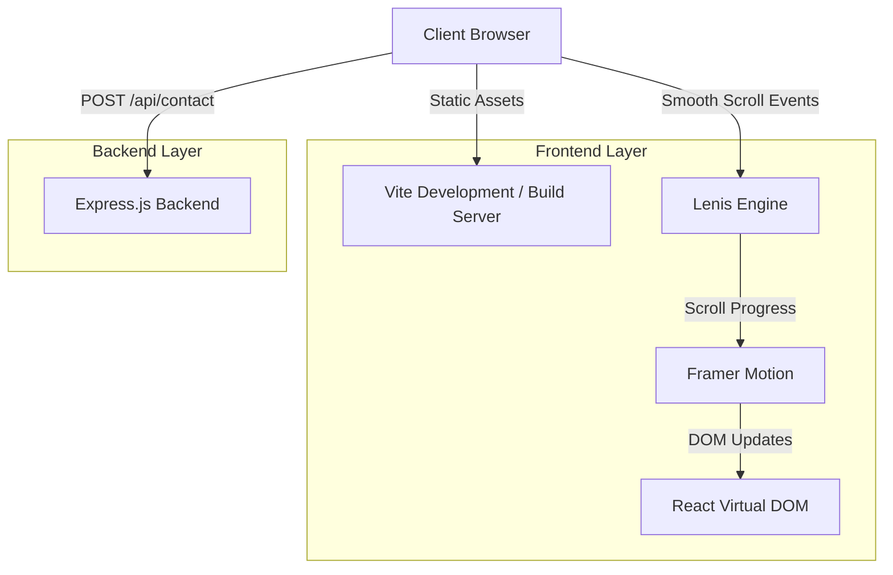
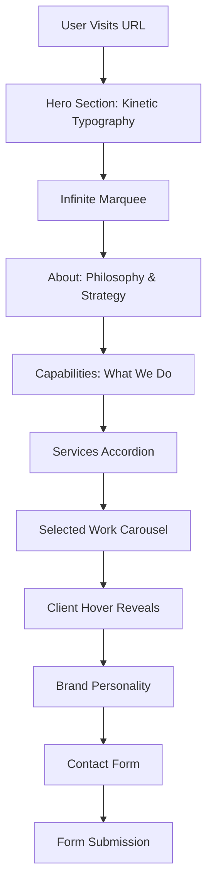
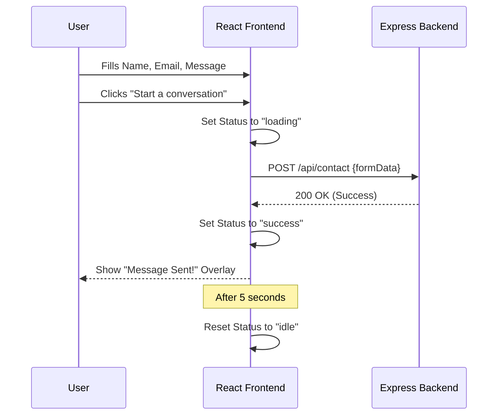
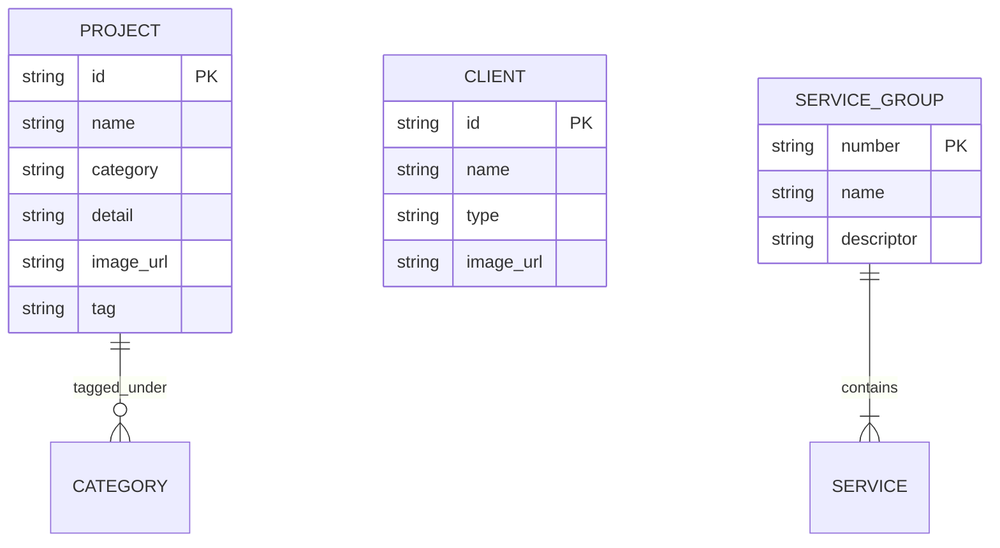
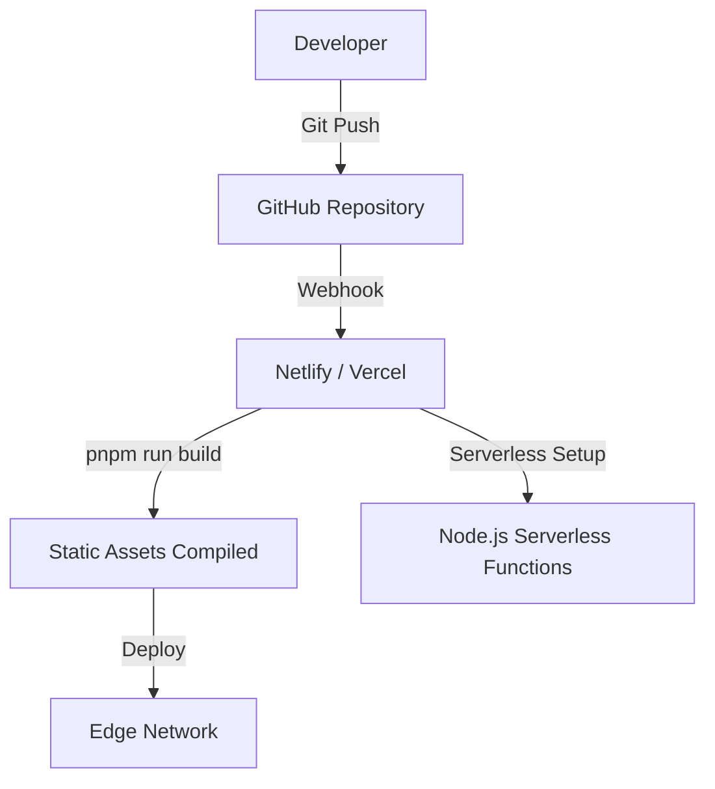

# 🚀 Dealpost - Brand Narratives Portfolio


---

## 📖 Overview

**Problem Statement:** 
Creative agencies need a digital presence that perfectly reflects their design philosophy. Traditional portfolios fail to capture the dynamic, strategic, and creative essence of high-end branding work, leading to lower engagement and missed enterprise-level clients.

**Solution:**
The **Dealpost Brand Narratives Portfolio** is a premium, highly interactive Single Page Application (SPA). It acts as the ultimate "all-in-one marketing hub," showcasing the agency's capabilities in visual identity, digital presence, and packaging through a kinetic, scroll-driven cinematic experience.

**Real-world Importance:**
This platform serves as the primary digital storefront and sales tool for Dealpost. By combining seamless animations, smooth scrolling, and a robust interactive UI, it establishes immediate authority and trust with prospective clients.

**Target Users:**
- Enterprise Brands & Startups seeking branding and marketing solutions.
- CMOs and Business Owners looking for end-to-end creative partners.
- Design enthusiasts and prospective talent.

---

## 🧠 System Architecture

### 📊 Architecture Diagram



### 🏗️ Explanation
- **Frontend Architecture:** The application is a React 18 SPA built with Vite. It heavily relies on client-side state and animation libraries (Framer Motion) to create a fluid user experience.
- **Scroll Hijacking:** Native scrolling is overridden by `Lenis` to provide a normalized, buttery-smooth scroll experience, which is essential for triggering precise entrance animations.
- **Backend API:** A lightweight Express server handles contact form submissions, abstracting away email/database logic from the client.

---

## 🔄 Application Flow

### 📌 Flowchart



---

## 🔁 Sequence Diagram (Contact Flow)



---

## 🧩 Module Breakdown

- **Hero & Intro (`Index.tsx`):** Implements dynamic scrolling text based on scroll position (`useScroll`).
- **Services Module:** An interactive accordion-style component mapping 6 core capabilities (Branding, Digital, Social Media, etc.) to specific service lists.
- **WorkRail Module:** An automated and manual carousel displaying 26 handpicked portfolio pieces, utilizing Framer Motion for smooth sliding transitions.
- **Clients Module:** A list-based interaction where hovering over a client name triggers a sticky image reveal using `AnimatePresence`.
- **ContactForm Module:** A fully controlled React form with integrated loading, success, and error states connecting to the Express backend.

---

## ✨ Features

**Beginner:**
- Fully responsive design customized for mobile, tablet, and desktop screens.
- Dark mode aesthetics using custom CSS variables (Mint, Ink, Teal, Deep).
- HTML5 Semantic structure.

**Advanced:**
- **Smooth Scrolling:** Integrated Lenis for hardware-accelerated scroll interpolation.
- **Scroll-Triggered Reveals:** Custom `<Reveal>` wrapper component that fades and translates elements into view as they enter the viewport.
- **Infinite Marquee:** CSS/JS driven horizontal scrolling banner that loops seamlessly.

**Expert:**
- **Custom Cursor Follower:** A spring-animated custom cursor that tracks mouse movement and displays contextual labels (e.g., "SEND" over the submit button).
- **Magnetic Links:** Navigation elements that attract to the user's cursor using mathematical bounding box calculations and Framer Motion spring physics.
- **Complex State Management:** Synchronized active states between auto-advancing carousels and dot indicators.

---

## 🧰 Tech Stack

### 1. React 18 & Vite 5
- **What it is:** The core UI library and build tool.
- **Why it is used:** For component-driven architecture and ultra-fast hot module replacement.
- **How it is used:** Defines the entire SPA within `Index.tsx`, utilizing hooks like `useState` and `useEffect`.

### 2. Tailwind CSS v4
- **What it is:** Utility-first CSS framework.
- **Why it is used:** Rapid styling without leaving the TSX file.
- **How it is used:** Heavily customized with CSS variables in `global.css` to enforce the agency's strict color palette.

### 3. Framer Motion
- **What it is:** A production-ready motion library for React.
- **Why it is used:** For complex, physics-based animations (springs) and scroll-linked UI changes.
- **How it is used:** Powers the `<Reveal>`, magnetic buttons, cursor follower, and carousel transitions.

### 4. Lenis
- **What it is:** A lightweight smooth scroll library.
- **Why it is used:** To prevent jarring native scroll behavior and ensure animations trigger smoothly.
- **How it is used:** Initialized in a global `useEffect` utilizing `requestAnimationFrame`.

### 5. Node.js & Express
- **What it is:** The backend JavaScript runtime and web framework.
- **Why it is used:** To securely handle form submissions without exposing logic on the client.
- **How it is used:** Serves as a REST API endpoint (`/api/contact`).

---

## 📂 Project Structure

### Current Structure
```text
📦 dealpost-portfolio
 ┣ 📂 client
 ┃ ┣ 📂 components
 ┃ ┣ 📂 hooks
 ┃ ┣ 📂 lib
 ┃ ┣ 📂 pages
 ┃ ┃ ┗ 📜 Index.tsx       # Main monolithic SPA page
 ┃ ┣ 📜 App.tsx           # React Router setup
 ┃ ┗ 📜 global.css        # Tailwind & Custom Variables
 ┣ 📂 server
 ┃ ┣ 📂 routes
 ┃ ┃ ┗ 📜 demo.ts         
 ┃ ┣ 📜 index.ts          # Express API setup
 ┃ ┗ 📜 node-build.ts
 ┣ 📂 public              # Static images (project1.png, etc.)
 ┣ 📜 package.json
 ┗ 📜 vite.config.ts
```

### 💡 Improved Structure (Recommended)
```text
📦 dealpost-portfolio
 ┣ 📂 client
 ┃ ┣ 📂 components
 ┃ ┃ ┣ 📂 ui              # Reusable generic (Reveal, Marquee, Buttons)
 ┃ ┃ ┗ 📂 sections        # Page sections (Hero, WorkRail, Services)
 ┃ ┣ 📂 data              # Move static arrays (projects, clientsData) here
 ┃ ┣ 📂 pages
 ┃ ┃ ┗ 📜 Index.tsx       # Clean entry point importing sections
...
```

---

## ⚙️ Installation & Setup

### 🖥️ System Requirements
- Node.js (v18+)
- `pnpm` (v10+)
- Windows / macOS / Linux

### 🔧 Step-by-Step Setup

1. **Clone repository:**
   ```bash
   git clone <your-repo-url>
   cd dealpost-portfolio
   ```

2. **Install dependencies:**
   ```bash
   pnpm install
   ```

3. **Configure environment variables:**
   Create a `.env` file in the root:
   ```env
   PORT=5000
   NODE_ENV=development
   ```

4. **Run Development Server:**
   ```bash
   # Starts Vite (frontend) and Express (backend) concurrently
   pnpm run dev
   ```

### ▶️ Run Modes
- **Development:** `pnpm run dev` (Runs locally with HMR).
- **Production Build:** `pnpm run build` (Compiles optimized static assets).
- **Start Production:** `pnpm start` (Serves the built application).

---

## 🔐 Security & Restrictions

- **API Security:** The Express backend is protected by `cors` middleware, ensuring only authorized origins can POST to the contact endpoint.
- **Form Validation:** Basic client-side required field validation is implemented before backend submission.
- **Client Restrictions:** Custom CSS prevents text selection on specific aesthetic elements (`select-none`) to maintain a clean UI experience.

---

## 📡 API Design

| Endpoint | Method | Payload | Description |
|----------|--------|---------|-------------|
| `/api/contact` | POST | `{ name, email, message }` | Handles contact form submissions. |
| `/api/ping` | GET | None | Health check endpoint. |

---

## 🗄️ Database Design

*Note: The application currently utilizes static JSON-like structures for performance. If migrating to a Headless CMS (like Sanity or Strapi), the conceptual schema is as follows:*

### 📊 ER Diagram (Conceptual Data Model)



---

## 🚀 DevOps & Deployment

### ⚙️ Deployment Diagram



- **Containerization:** A `.dockerignore` file exists, indicating readiness for Docker-based deployment if moving away from standard PaaS (Platform as a Service) providers.
- **CI/CD:** Optimized for zero-config deployment to Vercel/Netlify.

---

## 📈 Scalability & Performance

- **Lazy Rendering:** The `<Reveal>` components utilize Framer Motion's `whileInView` with a `viewport={{ once: true }}` prop, ensuring animations are only calculated when necessary and aren't re-run unnecessarily.
- **Animation Offloading:** The `InfiniteMarquee` uses CSS-compatible transformations to ensure animations are handled by the GPU rather than the CPU.
- **Memory Management:** The custom cursor implementation correctly cleans up event listeners on component unmount.

---

## 📊 Use Cases & 🎯 Benefits

### 💻 Technical Benefits
- **Zero Layout Shift:** Rigidly structured grids and predefined aspect ratios (`aspect-[4/3]`) ensure no Cumulative Layout Shift (CLS) during image loads.
- **Component Reusability:** The architecture of `Reveal`, `SectionLink`, and `MagneticLink` allows developers to easily expand the site with new sections.

### 💼 Business Benefits
- **Premium Positioning:** The site immediately filters for high-end clientele by demonstrating top-tier digital execution.
- **Frictionless Contact:** The inline, non-blocking contact form encourages immediate lead generation without navigating away from the portfolio.

---

## 🔮 Future Enhancements

- **Content Management System (CMS):** Move the hardcoded `projects` and `clientsData` into a headless CMS (Sanity.io) for non-technical team updates.
- **Asset Optimization:** Implement WebP auto-conversion and responsive image sets (srcset) to reduce the bandwidth of large portfolio imagery.
- **Three.js Implementation:** The repository includes Three.js packages; a future update could replace static background imagery with interactive WebGL shaders.

---

## 🧹 Project Optimization Report

Based on the audit of the codebase:
1. **Component Extraction:** `client/pages/Index.tsx` is monolithic (730 lines). Extract `WorkRail`, `Services`, and `Clients` into separate files inside `client/components/sections/` for better maintainability.
2. **Data Extraction:** Move `projects`, `clientsData`, and `serviceGroups` into a dedicated `client/data/portfolio.ts` file.
3. **Unused Dependencies:** Evaluate if `@react-three/fiber` and `@react-three/drei` are actively needed, as they are not currently instantiated in `Index.tsx`, yet add significant bundle weight.

---

## 🤝 Contribution Guide

1. Fork the Project.
2. Create your Feature Branch (`git checkout -b feature/NewFeature`).
3. Commit your Changes (`git commit -m 'Add NewFeature'`).
4. Run formatting (`pnpm run format.fix`).
5. Push to the Branch (`git push origin feature/NewFeature`).
6. Open a Pull Request.

---

## 📜 License

Distributed under the MIT License.
